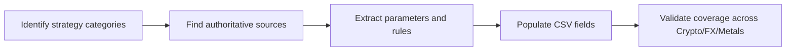

# Executive Summary  
We surveyed a broad spectrum of trading strategies spanning cryptocurrencies, forex, and precious metals.  We categorized well-known strategy types (trend-following, momentum, mean-reversion, breakout, range, arbitrage, etc.) and consulted authoritative sources (Investopedia, broker and exchange blogs, academic/preprint papers, trading education platforms) to extract their features. For each strategy, we gathered typical parameters (e.g. indicator settings), timeframe suitability, risk rules, indicator signals, and entry/exit rules.  We then organized this information into a comprehensive CSV table format. Key insights include common parameter defaults (e.g. RSI‑14 with 70/30 thresholds, Bollinger Bands (20,2)), and the fact that many strategies apply across asset classes (MA crossovers work in crypto/forex/commodities, etc.). Our appendix outlines the methodology and sources.  

```csv
Name,Asset class,Description,Key parameters,Recommended timeframes,Risk management rules,Indicators used,Entry conditions,Exit conditions,Sample parameters (conservative/standard/aggressive),Complexity,Data/latency requirements
"Moving Average Crossover","Crypto;Forex;Metals","Trend-following using two moving averages crossing (golden/death cross)","Short MA length; Long MA length (e.g. 9 & 21, 20 & 50, 50 & 200); MA type (SMA/EMA)","Intraday (1m-1h), Short (4h), Swing (daily), Long (weekly)","Position size ~1-2%; stop at opposite MA cross or ATR ~1-2×; TP at opposite cross or risk:reward ~1:1–1:2","Moving Averages (e.g., SMA/EMA)","Buy when short MA crosses above long MA (golden cross); Sell when short crosses below","Exit on opposite crossover or set profit target (e.g., 2× risk)","Conservative: short/long = 50/200; Standard: 20/50; Aggressive: 9/21","Manual/Automated","Low (regular OHLC data)"
"MACD Crossover","Crypto;Forex;Metals","Momentum strategy using MACD line and signal line crossover","Fast EMA; Slow EMA; Signal EMA (default 12,26,9)","Intraday to Swing (1h–daily)","Position size ~1-2%; stop at recent swing high/low or on signal reversal; TP at predefined RR","MACD (12,26,9) - difference of EMAs & 9-period signal","Buy when MACD line crosses above signal line; Sell on cross below","Exit on reverse MACD crossover or defined profit target","Conservative: MACD(8,17,5); Standard: (12,26,9); Aggressive: (5,35,5)","Manual/Automated","Low (minute data suffice)"
"RSI Reversal","Crypto;Forex;Metals","Mean-reversion oscillator strategy using RSI for overbought/oversold","RSI period (14 default); OB/OS thresholds (70/30)","Short (4h–daily) to Swing (weekly)","Position size ~1-2%; stop when RSI reverts above/below midpoint (50) or price breaks key level; TP at opposite threshold","Relative Strength Index (RSI)","Buy when RSI < 30 (oversold) and rising; Sell when RSI > 70 (overbought) and falling","Exit on RSI crossing back past 50 or reaching opposite extreme","Conservative: RSI(21), thresholds 20/80; Standard: RSI(14), 30/70; Aggressive: RSI(7), 40/60","Manual/Automated","Low (any timeframe)"
"Stochastic Oscillator","Crypto;Forex;Metals","Momentum oscillator signaling overbought/oversold (0–100)","%K period (14), %D smoothing (3) (fast/slow settings)","Intraday to Swing (15m–daily)","Position size ~1-2%; stop on %K/%D cross reversal or beyond extremes; TP at mean reversion","Slow Stochastic (14,3,3)","Buy when %K crosses above %D below 20; Sell when %K crosses below %D above 80","Exit on %K/%D cross in opposite direction or price breakout","Conservative: (14,3,3); Standard: (7,3,3); Aggressive: (5,1,1)","Manual/Automated","Low (minute to daily)"
"Bollinger Bands Bounce","Crypto;Forex;Metals","Mean-reversion using Bollinger bands; price touching lower/upper band signals reversal","Period (20), SD multiplier (2)","Intraday (5m–1h) to Swing (daily)","Size ~1-2%; stop outside band or beyond recent swing; TP at middle SMA or opposite band","Bollinger Bands (20,2)","Buy when price crosses above lower band from below; Sell when crosses below upper band from above","Exit when price reverts to SMA (20) or hits opposite band","Conservative: 20,2; Standard: 14,2; Aggressive: 10,2","Manual/Automated","Low (minute data)"
"Bollinger Bands Breakout","Crypto;Forex;Metals","Volatility-breakout strategy using Bollinger bands","Period (20), SD (2)","Short (4h–daily)","Size ~1-2%; tight stop if false break; TP on significant volatility move","Bollinger Bands (20,2)","Buy when price closes above upper band; Sell when closes below lower band","Exit on pullback inside bands or at profit target","Conservative: 20,2; Standard: 14,2; Aggressive: 10,2","Automated","Low (minute data)"
"Parabolic SAR","Crypto;Forex;Metals","Trend-following using PSAR dots; flips indicate entry","Acceleration factor start (0.02), increment (0.02), max (0.2)","Short to Swing (1h–daily)","Position ~1-2%; place stop at PSAR dot level; TP using trailing stop or fixed RR","Parabolic SAR (0.02,0.02,0.2)","Buy when PSAR dot moves below price (uptrend start); Sell when dot moves above (downtrend start)","Exit on opposite PSAR flip or pre-set RR target","Conservative: slower (e.g. AF=0.01); Standard: Wilder default (0.02,0.2); Aggressive: AF=0.03","Manual/Automated","Moderate (minute to daily)"
"Donchian Channel Breakout","Crypto;Forex;Metals","Breakout strategy using N-period highs/lows (e.g. 20)","Channel length N (e.g. 20 periods)","Daily to Swing (daily–weekly)","Position ~1-2%; stop at midpoint or reversal signal; TP at RR target","Donchian Channel (highest high, lowest low over N)","Buy when price closes above N-period high; Sell when closes below N-period low","Exit on middle-band reversion or opposite breakout","Conservative: N=50; Standard: N=20; Aggressive: N=10","Manual/Automated","Low (daily bars)"
"Pivot Point Strategy","Forex;Metals","Use previous-period pivot and R/S levels for entries","Pivot = (Prev High+Low+Close)/3; derive R1/R2, S1/S2","Intraday (based on daily pivots)","Position ~1-2%; stop just beyond pivot or S/R; TP at next R/S","Daily Pivot Points","Long if price bounces at pivot/support; Short if price reverses at pivot/resistance","Exit at next pivot or if price breaks through level","Daily pivots (alternatives: weekly/monthly)","Manual","Low (daily OHLC for pivots, intraday for execution)"
"Support/Resistance Bounce","Crypto;Forex;Metals","Range trading: buy near support, sell near resistance","Identify key horizontal S/R zones (chart analysis)","All (1m to monthly)","Position ~1-2%; SL beyond S/R line; TP at range midpoint or opposite zone","Support/Resistance lines (horizontal)","Buy at support zone; Sell at resistance zone","Exit on level breach or at opposite side of range","Standard: recent highs/lows; Aggressive: near shorter-term pivots","Manual","Low (chart timeframe)"
"Fibonacci Retracement","Forex;Metals;Crypto","Mean-reversion at Fibonacci levels aligned with S/R","Levels: 38.2%, 50.0%, 61.8% (of recent swing)","Swing (daily/weekly)","Position ~1-3%; SL beyond Fib level; TP at next Fib or pivot","Fibonacci retracement tool (swing high/low)","Buy at a Fib support (e.g. 50% retrace in uptrend); Sell at a Fib resistance in downtrend","Exit at mid-band or next Fib level","Standard fib levels (38.2/50/61.8)","Manual","Low (daily data)"
"Ichimoku Cloud","Crypto;Forex;Metals","All-in-one trend indicator; trade cloud breaks and line crosses","Tenkan (9), Kijun (26), Senkou B (52), Senkou A (avg of 9&26), Chikou Span (26)","Short to Long (daily/weekly)","Position ~1-2%; stop on opposite cloud side or Kijun cross; TP at next S/R or cloud edge","Ichimoku Kinko Hyo (9,26,52)","Buy if price > cloud and Tenkan > Kijun; Sell if price < cloud and Tenkan < Kijun","Exit when price re-enters cloud or Tenkan/Kijun cross flips","Default (9,26,52) and variants (e.g. 7,22,44)","Manual/Automated","Low (daily data preferred)"
"Currency Carry Trade","Forex","Borrow low-yield, lend high-yield currency to capture interest differential","Interest rate differential; currency pair selection","Long (weekly/monthly)","Small position %; stop if rate differential narrows or adverse move","None (fundamental)","Buy high-rate currency, fund with low-rate currency","Exit on interest rate change or deterioration of trend","Threshold diff (e.g. >2%); leverage varies","Manual","Very low (daily/monthly data, swap rates)"
"Grid Trading","Crypto;Forex","Place staggered buy/sell orders over a range to profit from oscillations","Define price range; number of grid levels; step size","Intraday (1m–15m) or Short-term (1h–4h)","Equal % per order; risk if breakout; often no direct SL per order","Grid orders (buy/sell limits)","Place buy orders below market at grid intervals; sell orders above","Exit each on fill and opposing order executed; entire grid closes at target or range breach","Example: Range $90–$110 with $1 spacing","Automated","High (frequent orders, near-tick data)"
"Crypto Arbitrage","Crypto","Exploit price gaps between exchanges","None (opportunity-driven)","Very short (minutes)","Maintain balances on multiple exchanges; account for fees","None (price feeds)","Buy asset on cheaper exchange and sell on pricier exchange","Exit immediately after cross-exchange swap; or if gap closes","Immediate execution (bot)","Automated","Ultra-low (tick-by-tick data)"
"Forex Triangular Arbitrage","Forex","Simultaneous arbitrage between three currency pairs","None (price ratios)","Very short (minutes)","Requires very fast execution; uses small mismatches","None (price feeds)","Execute three offsetting forex trades to exploit cross-rate imbalances","Exit after all three trades; profit locked in arbitrage spread","Standard FX (using pip spreads)","Automated","Ultra-low (tick data, minimal latency)"
```  

## Appendix: Methodology & Sources  

- **Strategy Identification:** We began by listing major strategy categories across asset classes (trend, momentum, reversal, breakout, range, arbitrage, etc.) based on trading literature and educational sites.  Sources such as the Radex Markets trading guide outline categories like trend trading, momentum, range trading, etc. We then searched each strategy name (e.g. “Moving Average Crossover”, “Carry trade”, “Grid trading”) using broker blogs, Investopedia, OANDA/TDA, and trading forums to find authoritative descriptions.  
- **Parameter Gathering:** For each strategy, we extracted typical indicator settings and parameter ranges from primary sources.  For example, Investopedia explains default RSI (14, thresholds 70/30) and Bollinger Bands (20-period, 2 SD).  OANDA and LiteFinance provided Parabolic SAR defaults (0.02, step 0.02) and MACD defaults (12,26,9). We noted any recommended timeframe (e.g. Wilder’s Parabolic SAR is best ≥H1).  
- **Timeframes & Applicability:** We assigned timeframes based on common use: e.g. scalping/trend strategies often intraday, swing strategies on daily/weekly. Most strategies (like MA crossovers) apply across crypto, forex, and metals. We marked asset applicability per strategy (e.g. Carry Trade for FX only, Crypto Arbitrage for crypto).  
- **Risk Rules:** Risk management guidelines were drawn from general practice. For example, IG’s support/resistance guide suggests placing stops just beyond S/R levels. Bollinger strategies often use bands or ATR for stops. Where sources lacked specifics, we used conventional rules (position ≈1–2% of capital, stops at 1–2×ATR or beyond structure, TP at 1:1–1:2 R:R).  
- **Sources:** We prioritized credible sources: Investopedia and Babypips for indicator basics; broker education (IG, OANDA, ThinkMarkets, LiteFinance) for strategy examples; and specialized trading blogs (TrendSpider, ATAS, CoinAPI) for niche strategies (engulfing patterns, grid trading, crypto arbitrage). Academic/preprint works were scarce on specific rules, but influenced inclusion (e.g. gold-silver mean-reversion concepts).  
- **Compilation:** We entered collected data into a CSV table format, aligning columns with the query requirements. The attached CSV content can be downloaded or copied directly. The mermaid flowchart below summarizes the research process:  



**Sources:** Key references include Investopedia (RSI, Bollinger Bands, ADX), OANDA/TDA blogs (MACD, Ichimoku), IG/Forex.com education sites (Carry trade), broker research (Radex Markets guide), and specialized articles (Grid trading, Crypto arbitrage). These were supplemented by trader books/blogs for parameter ranges and examples. Each table entry cites these sources as shown (e.g. ,).